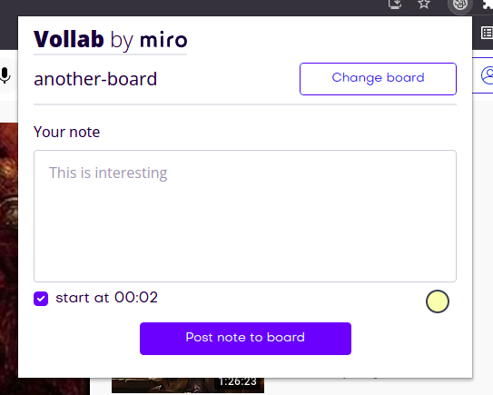

<h1 align="center">🚀 Vollab for Miro</h1>
<p align="center">Use this web extension to share video documentation notes
directly to Miro.</p>
<p align="center"></p>

## Features

- The watched videos automatically stops when the extension is open for efficiency
- The user can include the start time for a video section
- The user can customize the color of the sticky note in the extension
- The extension tabs closes automatically once a note is posted for efficiency
- Collaborators can review existing notes and go directly to the video, at the specified timestamp

## Technical specs

- React, React Hooks, React Context
- TypeScript
- Mirotone UI library
- Tailwind CSS & Headless UI
- Webpack
- Webextension polyfills

## 🚀 Quick Start

Ensure you have

- [Node.js](https://nodejs.org) 14 or later installed
- [NPM](https://www.npmjs.com/) v6.14 or later installed

Create a `.env` file in the project root, with your Miro Developer OAuth token,
like the following:

```
MIRO_API_TOKEN=xxxxxxxxxxxxxxxxxxxxxxxxxxx
```

### Development

- `npm install` to install dependencies.
- `npm run dev:chrome` to watch file changes in development


### Load extension in browser

- Go to the browser address bar and type `chrome://extensions`
- Check the `Developer Mode` button to enable it.
- Click on the `Load Unpacked Extension…` button.
- Select your extension’s extracted directory (`project_root/extension/chrome`).

## Browser Support

| [](/) | [](/) | [](/) | [](/) | [](/) | [](/) | [](/) |
| --------------------------------------------------------------------------------------------- | ------------------------------------------------------------------------------------------------ | ------------------------------------------------------------------------------------------ | --------------------------------------------------------------------------------------- | --------------------------------------------------------------------------------------------- | ------------------------------------------------------------------------------------------ | ------------------------------------------------------------------------------------------------ |
| 49 & later ✔                                                                                  | 52 & later ✔                                                                                     | 36 & later ✔                                                                               | 79 & later ✔                                                                            | Latest ✔                                                                                      | Latest ✔                                                                                   | Latest ✔                                                                                         |


## Credit

This is a project made for the [Junction 2021](https://www.junction2021.com/)
hackathon, in collaboration with the following team:
[@Poppy22](https://github.com/Poppy22),
[@predandrada](https://github.com/predandrada) and
[@MozartHetfield](https://github.com/MozartHetfield).


Using open-source packages and an extension boilerplate from
[Abhijith Vijayan](https://abhijithvijayan.in).
